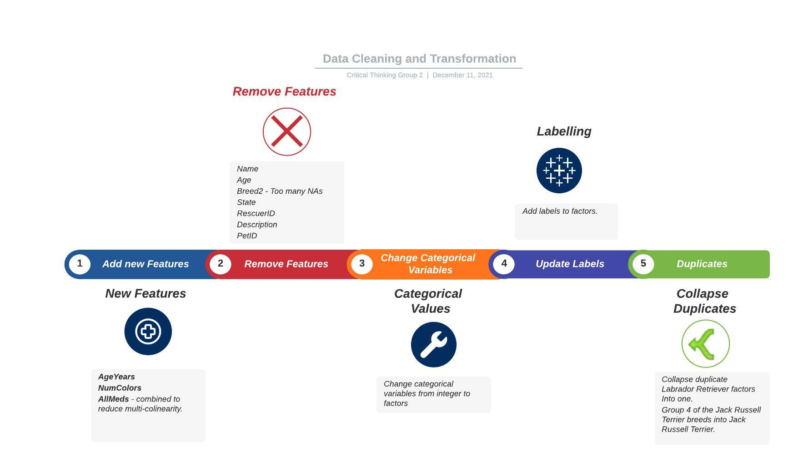

{width=100%}
\newpage

\tableofcontents

```{r setup, include=FALSE}
knitr::opts_chunk$set(echo = TRUE)
library(dplyr)
library(reshape)
library(ggplot2)
library(purrr)
library(psych)
library(tidyr)
library(corrplot)
library(forcats)
library(kableExtra)
library(summarytools)
library(stats)
library(GGally)
library(wordcloud)
library(Amelia)
library(MASS)
library(Hmisc)
library(foreign)
library(reshape2)
library(splines)
library(car)
library(effects)
library(here)
```

\newpage


# Overview

There are millions of stray pets around the world, some of which are fortunate enough to be adopted while many others are not.  While adoption of a pet is often the definition of success, the rate at which a pet is adopted is also a key success factor - pets that take a long time to adopt contribute to over-crowded animal shelters and can prevent taking on new strays.  Sadly, pets that are not adopted eventually need to be euthanized.

## Learn more about the data ^[https://www.kaggle.com/c/petfinder-adoption-prediction/data]

|Variable| Description |
|--------|-------------|
| PetID | Unique hash ID of pet profile                                                                                |
| AdoptionSpeed | **response variable** Categorical speed of adoption. Lower is faster.                                |
| Type | Type of animal (1 = Dog, 2 = Cat)                                                                             |
| Name | Name of pet (Empty if not named)                                                                              |
| Age | Age of pet when listed, in months                                                                              |
| Breed1 | Primary breed of pet (Refer to BreedLabels dictionary)                                                      |
| Breed2 | Secondary breed of pet, if pet is of mixed breed (Refer to BreedLabels dictionary)                          |
| Gender | Gender of pet (1 = Male, 2 = Female, 3 = Mixed, if profile represents group of pets)                        |
| Color1 | Color 1 of pet (Refer to ColorLabels dictionary)                                                            |
| Color2 | Color 2 of pet (Refer to ColorLabels dictionary)                                                            |
| Color3 | Color 3 of pet (Refer to ColorLabels dictionary)                                                            |
| MaturitySize | Size at maturity (1 = Small, 2 = Medium, 3 = Large, 4 = Extra Large, 0 = Not Specified)               |
| FurLength | Fur length (1 = Short, 2 = Medium, 3 = Long, 0 = Not Specified)                                          |
| Vaccinated | Pet has been vaccinated (1 = Yes, 2 = No, 3 = Not Sure)                                                 |
| Dewormed | Pet has been dewormed (1 = Yes, 2 = No, 3 = Not Sure)                                                     |
| Sterilized | Pet has been spayed / neutered (1 = Yes, 2 = No, 3 = Not Sure)                                          |
| Health | Health Condition (1 = Healthy, 2 = Minor Injury, 3 = Serious Injury, 0 = Not Specified)                     |
| Quantity | Number of pets represented in profile                                                                     |
| Fee | Adoption fee (0 = Free)                                                                                        |
| State | State location in Malaysia (Refer to StateLabels dictionary)                                                 |
| RescuerID | Unique hash ID of rescuer                                                                                |
| VideoAmt | Total uploaded videos for this pet                                                                        |
| PhotoAmt | Total uploaded photos for this pet                                                                        |
| Description | Profile write|up for this pet. The primary language used is English, with some in Malay or Chinese.    |


## What to Predict?

**Predictor** (Adoption Speed)  
**Description:** Predict how quickly, if at all, a pet is adopted.  

The values are determined in the following way:  
- 0. Pet was adopted on the same day as it was listed.  
- 1. Pet was adopted between 1 and 7 days (1st week) after being listed.  
- 2. Pet was adopted between 8 and 30 days (1st month) after being listed.  
- 3. Pet was adopted between 31 and 90 days (2nd & 3rd month) after being listed.  
- 4. No adoption after 100 days of being listed.  

\newpage
# Data Cleaning and Transformation
<insert image of quote>


## New Features 
We added the following new features: 

|Variable| Description |
|--------|-------------|
|AgeYears|provided in months this is too many variations.  Decided to convert to new feature of AgeYears and drop Age
|NumColors|derived by counting the number of colors a pet has using the `Color1`,`Color2`, and `Color3` features.|
|AllMeds|the sum of Vaccinated, Dewormed, and Sterilized.  Combining these into one feature could potentially reduce multi-collinearity|

\newpage
## Remove Features 

We decided to remove these features from the data set as inconsequential to our analysis: 

|Variable| Description |
|--------|-------------|
|Name | this is a text field and new owners can (and usually do) rename their pets, so removing this feature|
|Age | replaced with AgeYears *(see above)*|
|Breed2 | $10,700$ of almost $15,000$ rows are populated with $0$ *(unknown)*, so this doesn't seem like a good feature to keep|
|State | initially kept this, but the correlation to AdoptionSpeed is only about 2%.  Decided to remove it|
|RescuerID | common sense is that this field will not have any predictive value for adoption rate|
|Description | this will have value in future analysis for NLP, but this will be evaluated differently in another notebook|
|PetID | same reason as RescuerID|

## Other data cleaning and transformation

We performed some other data cleaning and transformation tasks like:  

1. Change categorical variables from integer to factors.  
2. Add Labels by recoding certain values:  
2.1. **Type**: "1" = "Dog", "2" = "Cat"  
2.2. Import the color labels to use the names of the colors.  
2.3. Adding labels to `Gender` variable per definitions assigned to create `GenderLabel`.  
2.3. Adding labels to `MaturitySize`, `Health` and `FurLength`.    
2.4. Adding labels to `Vaccinated`, `Dewormed`, `Sterilized`. A number of observations in these columns are `Not Sure` which can be interpreted as `NA`. Similarly, the `VideoAmt` variable contains 14419 observations with 0 videos so the 0s have been converted to `NA`.  
2.5. Converting the `breedname` and `AllMeds` variables to factor since the original data points used to create these were factors.  
3. We collapsed duplicate Labrador Retriever factors (Black, Chocolate, and Yellow) into one as they are not considered to be separate ^https://www.akc.org/expert-advice/dog-breeds/retriever-breeds/]. 
4. We also grouped 4 of the Jack Russell Terrier (Parson Russell Terrier) breeds into Jack Russell Terrier.  

\newpage
# Data Analysis and visualization 

We explore our data to investigate, among other things, the correlation among variables in the data that could be used in our models. 

```{r fig.height=3.5, message=FALSE, warning=FALSE, include=FALSE}
# load data
data <- read.csv('./data/TrainingData/train_cleaned.csv')
```

## Feature Correlation

### Correlation of each feature to AdoptionSpeed
```{r message=FALSE, warning=FALSE, include=FALSE}
#Function to calculate each feature's correlation to AdoptionSpeed
correlations <- function(data) {
  res_vector  <- vector()
  colnames_vector <- colnames(data)
  
  for(i in 1:ncol(data)) {
    
    res <- cor.test(data[ , i], data$AdoptionSpeed, 
                      method = "pearson")
    
    res_round = abs(round(res$estimate,4))
    
    res_vector <- c(res_vector, res_round)
  }
  
  corrdf <- data.frame(colnames_vector, res_vector)
  corrdf_sort <- corrdf %>% arrange(desc(res_vector))
  
  #Remove AdoptionSpeed from correlation df
  corrdf_sort = corrdf_sort[-c(1),]
  
  return(corrdf_sort)
}
```

```{r echo=FALSE, message=FALSE, warning=FALSE}
#Dogs and Cats: each feature's correlation to AdoptionSpeed
corrdf_sort = correlations(data)

ggplot(corrdf_sort, aes(x=reorder(colnames_vector,res_vector), y=res_vector)) +
  geom_bar(stat="identity") + 
  ggtitle("Correlations to Adoption Speed - Dogs and Cats") +
  theme(axis.text.x = element_text(angle = 90, size = 10))
```

### Visual Correlation between features

```{r echo=FALSE, fig.height=3.5, fig.width=6, message=FALSE, warning=FALSE}
corrplot.mixed(cor(data %>% keep(is.numeric)), 
               tl.col = 'black',
               tl.pos = 'lt',
               upper = "number"
               , lower="shade", shade.col=NA, tl.srt=45)
```

## Dog Breed Word Cloud

Below we use `wordcloud` to visualize the dog breeds in our data. Note the Mixed Breed has been removed as it was skewing our data with the highest number of observations with 5923 total.

```{r echo=FALSE, fig.height=3.5, message=FALSE, warning=FALSE}
set.seed(123)
train_data <- read.csv(here('data','processed_data','train_data_gh.csv'))

dogs <- train_data %>% 
  filter(Type== "Dog")

wordtable <- table(dogs$breedname) %>% 
  as.data.frame() %>% 
  filter(Freq >0) %>% 
  arrange(desc(Freq)) %>% 
  slice(c(-1))

wordcloud(words = wordtable$Var1, freq = wordtable$Freq,
          max.words=250,random.order=FALSE, scale=c(2,.8),
          rot.per=0.1, colors=brewer.pal(8, "Dark2"))
```

## Cat Breed Word Cloud

Below we use `wordcloud` to visualize the cat breeds in our data.  

```{r echo=FALSE, fig.height=3.5, message=FALSE, warning=FALSE, paged.print=FALSE}
set.seed(456)
cats <- train_data %>% 
  filter(Type== "Cat")

wordtable2 <- table(cats$breedname) %>% 
  as.data.frame() %>% 
  filter(Freq >0) %>% 
  arrange(desc(Freq)) 

wordcloud(words = wordtable2$Var1, freq = wordtable$Freq,
          max.words=250,random.order=FALSE, scale=c(2,.8),
          rot.per=0.1, colors=brewer.pal(8, "Dark2"))
```

\newpage
## Bar plots

As part of exploring the data, below we look into our response variable and see which level of `AdoptionSpeed` has the most occurrences.   

```{r echo=FALSE, fig.height=3, message=FALSE, warning=FALSE}
train_data %>% 
  group_by(PhotoAmt) %>%
  summarise(Count = length(PhotoAmt)) %>% 
  arrange(desc(Count)) %>% 
  top_n(10) %>% 
  ggplot(aes(x=fct_reorder(factor(PhotoAmt),Count), 
             y= Count))+
  geom_col(position="dodge", fill= "steelblue")+
  geom_text(aes(label = Count, hjust = 1))+
  coord_flip()+
  labs(x= "Photos per Listing", y = "Listing Count")+
  theme_minimal()
```

\newpage
## Distributions of Numeric Variables

We subset our numeric predictor variables to check their distributions.

```{r echo=FALSE}
#subset our 3 vars
distributions <- train_data %>% 
  keep(is.numeric)

#box plots
distributions %>% 
  gather() %>%
  ggplot(aes(value)) +
  facet_wrap(~ key, scales = "free") +
  geom_boxplot(fill = "steelblue", color="black", outlier.colour="red", outlier.shape=16,
             outlier.size=2, notch=FALSE) +
  theme_minimal()
```

## Transformations of numeric variables

Next we will take transformations of the variables reviewed above to see if the transformed variables are worth looking into and using for our model.

## Log Transformations

```{r echo=FALSE, fig.height=3, message=FALSE, warning=FALSE}
log_distributions <- log(distributions + 1)

# Histograms of log transformed numeric variables
log_distributions %>%
  gather(variable, value, 1:4) %>%
  ggplot(., aes(value)) + 
  geom_density(fill = "steelblue", color="steelblue") + 
  facet_wrap(~variable, scales ="free") +
  labs(x = element_blank(), y = element_blank()) +
  theme_minimal()
```
  

## Cube root transformations

```{r echo=FALSE, fig.height=3, message=FALSE, warning=FALSE}
cbrt_distributions <- (distributions)^(1/3)

cbrt_distributions %>% 
  gather(variable, value, 1:4) %>%
  ggplot(., aes(value)) + 
  geom_density(fill = "steelblue", color="steelblue") + 
  facet_wrap(~variable, scales ="free", ncol = 2) +
  labs(x = element_blank(), y = element_blank()) +
  theme_minimal()
```

Based on the above, all variables are still heavily right skewed with the exception of `PhotoAmt` which made some improvement, but still not normally distributed. 

\newpage
# Data Modeling
## Ordinary Logistic Regression Model 

We created several models using ordinal logistic regression since response variable can be considered an ordinal factor. [Ordinary Logistic Regression](https://stats.idre.ucla.edu/r/dae/ordinal-logistic-regression/)

```{r model2_def, echo=FALSE, message=FALSE, warning=FALSE, paged.print=TRUE}
train_data2 <- read.csv(here('data','processed_data','train_data_gh_final.csv'))
train_data2$Type <- as.factor(train_data2$Type)
train_data2$Gender <- as.factor(train_data2$Gender)
train_data2$Color1 <- as.factor(train_data2$Color1)
train_data2$MaturitySize <- as.factor(train_data2$MaturitySize)
train_data2$FurLength <- as.factor(train_data2$FurLength)
train_data2$Health <- as.factor(train_data2$Health)
train_data2$NumColors <- as.factor(train_data2$NumColors)
train_data2$AllMeds <- as.factor(train_data2$AllMeds)
train_data2$purebreed <- as.factor(train_data2$purebreed)
train_data2$euth_risk <- as.factor(train_data2$euth_risk)

model_2 <- polr(euth_risk~ Type+(Gender+Color1+MaturitySize+
                                 FurLength+Health+Quantity+
                                 Fee+PhotoAmt+AgeYears+
                                 NumColors+purebreed+
                                 AllMeds), 
              train_data2, 
              Hess=TRUE)

summary(model_2)
```

## OLR Histogram 

After dealing with multicollinearity and insignificant values, we see that the model with the lowest AIC value of the models created is `model_2` with an AIC of 29952.42.

```{r model2_hist, echo=FALSE, fig.height=3, message=FALSE, warning=FALSE}
hist(model_2$fitted.values, 
     main = " Histogram ",
     xlab = "Fitted models", 
     col = 'skyblue3')
```

## OLR Predictions

Below we generate our predictions with the `predict` function [Toward Data Science - OLR](https://towardsdatascience.com/implementing-and-interpreting-ordinal-logistic-regression-1ee699274cf5).

```{r echo=FALSE, message=FALSE, warning=FALSE, paged.print=TRUE}
evaluation <- read.csv(here("data","TestData","test_cleaned.csv"))

#Gender+Color1+MaturitySize+FurLength+Health+Quantity+Fee+PhotoAmt+AgeYears+NumColors+purebreed+Vaccinated+Dewormed+Sterilized

evaluation$AllMeds = evaluation$Vaccinated + evaluation$Dewormed + evaluation$Sterilized

evaluation$Color1 <- recode_factor(evaluation$Color1,"1"= "Black", 
                                "2"= "Brown", 
                                "3"= "Golden", 
                                "4"= "Yellow", 
                                "5"= "Cream", 
                                "6"= "Gray", 
                                "7"= "White")

evaluation$Type <- recode_factor(evaluation$Type, 
                                 "1" = "Dog",
                                 "2"= "Cat")

#data$GenderLabel
evaluation$Gender <- recode_factor(evaluation$Gender, 
                                  "1" = "Male",
                                  "2" = "Female",
                                  "3" = "Mixed")

evaluation$MaturitySize <- recode_factor(evaluation$MaturitySize, "1" = "Small", 
                                   "2" = "Medium",
                                   "3" = "Large",
                                   "4" = "Extra Large")

#1 = Healthy, 2 = Minor Injury, 3 = Serious Injury, 0 = Not Specified
evaluation$Health <-recode_factor(evaluation$Health, 
                                   "1" = "Healthy", 
                                   "2" = "Minor Injury", 
                                   "3" = "Serious Injury")

#FurLength - Fur length (1 = Short, 2 = Medium, 3 = Long, 0 = Not Specified)
evaluation$FurLength <-recode_factor(evaluation$FurLength, 
                                   "1" = "Short", 
                                   "2" = "Medium", 
                                   "3" = "Long")

evaluation$purebreed <- ifelse(evaluation$Breed1 != 307, "Yes", "No")
evaluation$purebreed <-  as.factor(evaluation$purebreed)

evaluation$NumColors <- as.factor(evaluation$NumColors)
evaluation$AllMeds <- as.factor(evaluation$AllMeds)

evaluation$AgeYears <- as.numeric(evaluation$AgeYears)

evaluation = subset(evaluation, select = -c(Breed1, Color2, Color3, 
                                            Vaccinated, Dewormed, Sterilized, 
                                            State, VideoAmt))
pred <- predict(model_2, evaluation, type = "p")

head(pred, 1)
```

This model predicts that our Evaluation_Pet will be a medium risk of euthanasia where it will adopted in either months 1, 2 or 3 of being listed.

\newpage
## Binomial Logistic Regression Model

We built a Binomial Logistic Regression Model using a subset of the training data of only dogs. After using the Step Method we arrived at the best fitted model.

```{r message=FALSE, warning=FALSE, include=FALSE, paged.print=TRUE}
train_data_dog <- read.csv(here('data',
                                'processed_data',
                                'train_data_kh_final.csv'))

train_data_dog <- transform(
  train_data_dog,
  Gender=as.factor(Gender),
  MaturitySize=as.factor(MaturitySize),
  FurLength=as.factor(FurLength),
  Vaccinated = as.factor(Vaccinated),
  Dewormed = as.factor(Dewormed),
  Sterilized = as.factor(Sterilized),
  Health = as.factor(Health),
  NumColors = as.factor(NumColors)
)

null_dog_model <- glm(AdoptionSpeed ~ 1, 
                      data = train_data_dog, 
                      family = binomial(link ="logit"))

model_dog2 <- glm(AdoptionSpeed ~  Gender+MaturitySize +FurLength+ Vaccinated+ Dewormed+ Sterilized + Health + Quantity + Fee + VideoAmt + PhotoAmt + AgeYears + NumColors, data = train_data_dog, family = binomial(link ="logit"))

step_b <- step(null_dog_model, scope = list(upper=model_dog2),direction="both")
step_b$anova
```

```{r echo=FALSE, fig.height=3.5, message=FALSE, warning=FALSE, paged.print=TRUE}
hist(step_b$fitted.values, main = " Histogram ",xlab = "Fitted models", col = 'skyblue3')

#train_data_dog$Predict <- ifelse(step_b$fitted.values >0.5,"pos","neg")
#head(train_data_dog$Predict)
```

Here we can see the model works really well on the train data, we need to use it on the evaluation data and check the accuracy of the model on it.

## BLR Predictions 

When we apply the model to the evaluation data we get the following results.

```{r echo=FALSE, message=FALSE, warning=FALSE}
evaluation2 <- read.csv(here("data","TestData","test_cleaned.csv"))

evaluation2 <- transform(
  evaluation2,
  Type=as.factor(Type),
  Breed1=as.factor(Breed1),
  Gender=as.factor(Gender),
  Color1=as.factor(Color1),
  Color2=as.factor(Color2),
  Color3=as.factor(Color3),
  MaturitySize=as.factor(MaturitySize),
  FurLength=as.factor(FurLength),
  Vaccinated = as.factor(Vaccinated),
  Dewormed = as.factor(Dewormed),
  Sterilized = as.factor(Sterilized),
  Health = as.factor(Health),
  NumColors = as.factor(NumColors)
)

#transformed variables
evaluation2 <- evaluation2 %>% 
  dplyr::select(Gender,MaturitySize ,FurLength, Vaccinated, Dewormed, Sterilized , Health , Quantity , Fee , VideoAmt , PhotoAmt , AgeYears , NumColors)

#predictions
pred <- predict(model_dog2, evaluation2, type = "response")

# The predictions variable
pred_df <- as.data.frame(pred)

#Round the values to 4
pred_df$values <- round((exp(pred_df$pred)),4)

# Creating Bar chart for the predictive values.
ggplot(pred_df, aes(x=values)) + 
 geom_histogram(aes(y=..density..), colour="black", fill="white")+
 geom_density(alpha=.2, fill="steelblue")+
labs(title="Predicted Value",x="Adoption", y = "Density")
```

We can see that the adoption values is more skewed to the right, the density of the adoption rate is more around $2.5$ to $2.75$

\newpage
## Negative Binomial Model
We also trained several Negative Binomial Models and found the best fit would be the one that uses a few significant variables.

```{r echo=FALSE, fig.height=3.5, message=FALSE, warning=FALSE}

train1 <- read.csv(here('data','processed_data','train_data_ml_final.csv'))
modelnegb2 <- glm.nb(High~ Age  + FurLength  + Health+
                as.factor(Gender) +
                as.factor(Vaccinated) + 
                as.factor(Sterilized)+
                as.factor(Color1), data = train1)


pred <- predict(modelnegb2, train1, type = "response")
summary(pred)

# The predictions variable
pred_df <- as.data.frame(pred)

#Round the values to 4
pred_df$values <- round((exp(pred_df$pred)),4)

# Creating Bar chart for the predictive values.
ggplot(pred_df, aes(x=values)) + 
 geom_histogram(aes(y=..density..), colour="black", fill="white")+
 geom_density(alpha=.2, fill="steelblue")+
labs(title="Predicted Value",x="Adoption", y = "Density")
```

It can be observed that based on the prediction that Mean is $0.4953$ and Median is $0.518$. 

\newpage
## Random Forest, XGBoost

Helpful article from [TowardsDataScience](https://towardsdatascience.com/random-forest-in-r-f66adf80ec9)

We explored other models like Random Forest and XGBoost.  However, we were not able to get a better fit than with Binomial or OLR.  Here a confusion matrix from one of our RF Models:

```{r pressure, echo=FALSE, fig.height=3.5, message=FALSE, warning=FALSE, paged.print=TRUE}
data <- read.csv(here('data','TrainingData','train_cleaned.csv'))

data <- transform(
  data,
  Type=as.factor(Type),
  #Breed1=as.factor(Breed1),
  Gender=as.factor(Gender),
  Color1=as.factor(Color1),
  Color2=as.factor(Color2),
  Color3=as.factor(Color3),
  MaturitySize=as.factor(MaturitySize),
  FurLength=as.factor(FurLength),
  Vaccinated = as.factor(Vaccinated),
  Dewormed = as.factor(Dewormed),
  Sterilized = as.factor(Sterilized),
  Health = as.factor(Health),
  AdoptionSpeed = as.factor(AdoptionSpeed),
  NumColors = as.factor(NumColors)
)
source(here('R','rf_model_func.R'))
source(here('R','draw_confusion_matrix.R'))
#### RF Model #1
#dataframe for RF model 1
rf_model1_data <- subset(data, select = c(Type,Breed1,FurLength,Gender,Sterilized,Quantity,AgeYears,Vaccinated,AdoptionSpeed))
  
rf_confusion_matrix <- rf_model_func(rf_model1_data)
draw_confusion_matrix(rf_confusion_matrix)
```

\newpage
# Conclusions

We tried several models:  
- Ordinary Logistic Regression  
- Binomial Logistic Regression  
- Negative Binomial  
- Linear Modeling  
- Random Forest  
- XGBoost  

With the data provided, our best fitted models were the **OLR** and the **BLR**.

\newpage
# References 

*Kaggle - About the data.* "https://www.kaggle.com/c/petfinder-adoption-prediction/data".  Dec, 2021.   
*UCLA - Ordinary Logistic Regression.* "https://stats.idre.ucla.edu/r/dae/ordinal-logistic-regression/". Dec 2021.  
*TowardsDataScience - Random Forest in R.* "https://towardsdatascience.com/random-forest-in-r-f66adf80ec9". Dec 2021.  
*Toward Data Science - OLR.* "https://towardsdatascience.com/implementing-and-interpreting-ordinal-logistic-regression-1ee699274cf5".  Dec 2021.

\newpage
# Appendix A. 
## Notable Code.

```{r eval=FALSE}

### Function to Create Confusion Matrix 

create_rf_confusion_matrix <- function(pred, test){
  
  #Creates vectors having data points
  AdoptionSpeed_test = as.numeric(unlist(test$AdoptionSpeed))
  expected_value <- factor(c(AdoptionSpeed_test))
  
  predicted_value <- factor(c(pred))
  
  #Creating confusion matrix
  rf_confusion_matrix <- confusionMatrix(data=predicted_value, 
                                         reference = expected_value, 
                                         positive='1')
  
  #Results 
  return(rf_confusion_matrix)
}

### Function to draw confusion matrix 
### Credit: https://stackoverflow.com/questions/23891140/r-how-to-visualize-confusion-matrix-using-the-caret-package/42940553
draw_confusion_matrix <- function(cm) {
  
  total <- sum(cm$table)
  res <- as.numeric(cm$table)
  
  # Generate color gradients. Palettes come from RColorBrewer.
  greenPalette <- c("#F7FCF5",
                    "#E5F5E0",
                    "#C7E9C0",
                    "#A1D99B","#74C476",
                    "#41AB5D","#238B45",
                    "#006D2C","#00441B")
  redPalette <- c("#FFF5F0","#FEE0D2",
                  "#FCBBA1","#FC9272",
                  "#FB6A4A","#EF3B2C",
                  "#CB181D","#A50F15",
                  "#67000D")
  getColor <- function (greenOrRed = "green", amount = 0) {
    if (amount == 0)
      return("#FFFFFF")
    palette <- greenPalette
    if (greenOrRed == "red")
      palette <- redPalette
    colorRampPalette(palette)(100)[10 + ceiling(90 * amount / total)]
  }
  
  # set the basic layout
  layout(matrix(c(1,1,2)))
  par(mar=c(2,2,2,2))
  plot(c(100, 345), c(300, 450), type = "n", 
       xlab="", ylab="", xaxt='n', yaxt='n')
  title('CONFUSION MATRIX', cex.main=2)
  
  # create the matrix 
  classes = colnames(cm$table)
  rect(150, 430, 240, 370, col=getColor("green", res[1]))
  text(195, 435, classes[1], cex=1.2)
  rect(250, 430, 340, 370, col=getColor("red", res[3]))
  text(295, 435, classes[2], cex=1.2)
  text(125, 370, 'Predicted', cex=1.3, srt=90, font=2)
  text(245, 450, 'Actual', cex=1.3, font=2)
  rect(150, 305, 240, 365, col=getColor("red", res[2]))
  rect(250, 305, 340, 365, col=getColor("green", res[4]))
  text(140, 400, classes[1], cex=1.2, srt=90)
  text(140, 335, classes[2], cex=1.2, srt=90)
  
  # add in the cm results
  text(195, 400, res[1], cex=1.6, font=2, col='white')
  text(195, 335, res[2], cex=1.6, font=2, col='white')
  text(295, 400, res[3], cex=1.6, font=2, col='white')
  text(295, 335, res[4], cex=1.6, font=2, col='white')
  
  # add in the specifics 
  plot(c(100, 0), c(100, 0), type = "n", xlab="", 
       ylab="", main = "DETAILS", xaxt='n', yaxt='n')
  text(10, 85, names(cm$byClass[1]), cex=1.2, font=2)
  text(10, 70, round(as.numeric(cm$byClass[1]), 3), cex=1.2)
  text(30, 85, names(cm$byClass[2]), cex=1.2, font=2)
  text(30, 70, round(as.numeric(cm$byClass[2]), 3), cex=1.2)
  text(50, 85, names(cm$byClass[5]), cex=1.2, font=2)
  text(50, 70, round(as.numeric(cm$byClass[5]), 3), cex=1.2)
  text(70, 85, names(cm$byClass[6]), cex=1.2, font=2)
  text(70, 70, round(as.numeric(cm$byClass[6]), 3), cex=1.2)
  text(90, 85, names(cm$byClass[7]), cex=1.2, font=2)
  text(90, 70, round(as.numeric(cm$byClass[7]), 3), cex=1.2)
  
  # add in the accuracy information 
  text(30, 35, names(cm$overall[1]), cex=1.5, font=2)
  text(30, 20, round(as.numeric(cm$overall[1]), 3), cex=1.4)
  text(70, 35, names(cm$overall[2]), cex=1.5, font=2)
  text(70, 20, round(as.numeric(cm$overall[2]), 3), cex=1.4)
}

#### Function to create train and test

partition_data <- function(data, isTest) { 
  sample <- sample.split(data$AdoptionSpeed,
                         SplitRatio = .75)
  train <- subset(data,
                 sample == isTest)
  
  return(train)
}

#Create train data
create_train_data  <- function(data) {
  
  new_data <- partition_data(data, TRUE)
  
  return(new_data)
}

#Create test data
create_test_data  <- function(data) {
  
  new_data <- partition_data(data, FALSE)
  
  return(new_data)
}


rf_model_func <- function(data) {
  #train, test data for RF model 1
  rf_train = create_train_data(data)
  rf_test = create_test_data(data)
  
  #create RF model 1
  rf <- randomForest(
    AdoptionSpeed ~ .,
    data=rf_train
  )
  
  #Predict AdoptionSpeed with RF model 1
  rf_pred = predict(rf, newdata=rf_test)
  
  #Create a confusion matrix for RF model 1
  rf_confusion_matrix = create_rf_confusion_matrix(rf_pred, rf_test)
  return(rf_confusion_matrix)
}

xg_model_func <- function(data) {
  #train, test data for XG model 1
  xg_train = as.matrix(create_train_data(data))
  xg_test = as.matrix(create_test_data(data))
  
  #separate out the label
  adoption_speed_train = xg_train[ , ncol(xg_train)]
  adoption_speed_test = xg_test[ , ncol(xg_test)]
  
  #drop AdoptionSpeed from train and test
  xg_train = subset(xg_train, select=-c(ncol(xg_train)))
  xg_test = subset(xg_test, select=-c(ncol(xg_test)))
  
  #XGBoost requires a dgc matrix
  xg_train=as(xg_train, "dgCMatrix")
  xg_test=as(xg_test, "dgCMatrix")
  
  #Create the model
  xg <- xgboost(data = xg_train, 
                label = adoption_speed_train, 
                nrounds = 300, verbose=0)
  
  #Predict
  xg_pred <- predict(xg, xg_test)
  
  #Create a confusion matrix for XG model 1
  xg_pred = factor(as.integer(xg_pred))
  adoption_speed_test = factor(as.integer(adoption_speed_test))
  
  xg_confusion_matrix = confusionMatrix(xg_pred,
                                        adoption_speed_test)
  return(xg_confusion_matrix)
}


```
...