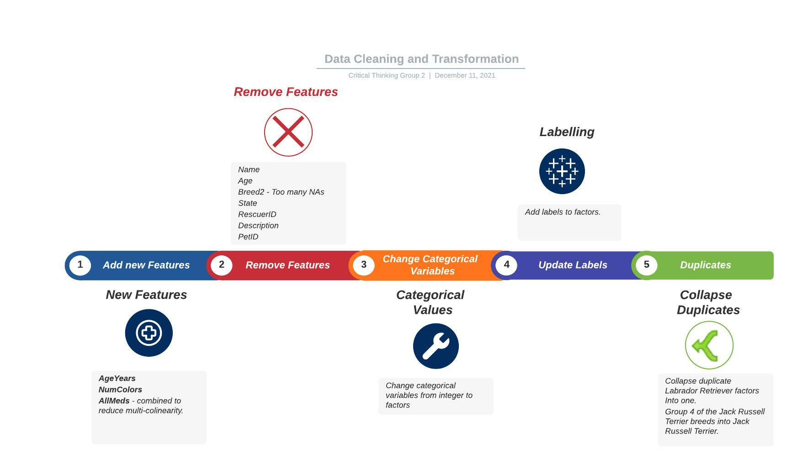

```{r setup, include=FALSE}
knitr::opts_chunk$set(echo = TRUE)
library(dplyr)
library(reshape)
library(ggplot2)
library(purrr)
library(psych)
library(tidyr)
library(corrplot)
library(forcats)
library(kableExtra)
library(summarytools)
library(stats)
library(GGally)
library(wordcloud)
library(Amelia)
library(MASS)
library(Hmisc)
library(foreign)
library(reshape2)
library(splines)
library(car)
library(effects)
library(here)
```

# Overview 

<insert image of quote>
{width=50%}

There are millions of stray pets around the world, some of which are fortunate enough to be adopted while many others are not.  While adoption of a pet is often the definition of success, the rate at which a pet is adopted is also a key success factor - pets that take a long time to adopt contribute to over-crowded animal shelters and can prevent taking on new strays.  Sadly, pets that are not adopted eventually need to be euthanized.

## Learn more about the data
[About the data](https://www.kaggle.com/c/petfinder-adoption-prediction/data)

# What to Predict
Predictor (Adoption Speed)<br> 
Description: Predict how quickly, if at all, a pet is adopted.<br>

The values are determined in the following way:<br>
0 - Pet was adopted on the same day as it was listed.<br>
1 - Pet was adopted between 1 and 7 days (1st week) after being listed.<br>
2 - Pet was adopted between 8 and 30 days (1st month) after being listed.<br>
3 - Pet was adopted between 31 and 90 days (2nd & 3rd month) after being listed.<br>
4 - No adoption after 100 days of being listed.

# Data Cleaning and Transformation
<insert image of quote>


# Dog Breed Word Cloud

Below we use `wordcloud` to visualize the dog breeds in our data. Note the Mixed Breed has been removed as it was skewing our data with the highest number of observations with 5923 total.

```{r echo=FALSE, fig.height=3.5, message=FALSE, warning=FALSE}
set.seed(123)
train_data <- read.csv(here('data','processed_data','train_data_gh.csv'))

dogs <- train_data %>% 
  filter(Type== "Dog")

wordtable <- table(dogs$breedname) %>% 
  as.data.frame() %>% 
  filter(Freq >0) %>% 
  arrange(desc(Freq)) %>% 
  slice(c(-1))

wordcloud(words = wordtable$Var1, freq = wordtable$Freq,
          max.words=250,random.order=FALSE, scale=c(2,.8),
          rot.per=0.1, colors=brewer.pal(8, "Dark2"))
```


# Ordinary Logistic Regression Model 

We created several models using ordinal logistic regression since response variable can be considered an ordinal factor. [Ordinary Logistic Regression](https://stats.idre.ucla.edu/r/dae/ordinal-logistic-regression/)

```{r model2_def, echo=FALSE, message=FALSE, warning=FALSE, paged.print=TRUE}
train_data2 <- read.csv(here('data','processed_data','train_data_gh_final.csv'))
train_data2$Type <- as.factor(train_data2$Type)
train_data2$Gender <- as.factor(train_data2$Gender)
train_data2$Color1 <- as.factor(train_data2$Color1)
train_data2$MaturitySize <- as.factor(train_data2$MaturitySize)
train_data2$FurLength <- as.factor(train_data2$FurLength)
train_data2$Health <- as.factor(train_data2$Health)
train_data2$NumColors <- as.factor(train_data2$NumColors)
train_data2$AllMeds <- as.factor(train_data2$AllMeds)
train_data2$purebreed <- as.factor(train_data2$purebreed)
train_data2$euth_risk <- as.factor(train_data2$euth_risk)

model_2 <- polr(euth_risk~ Type+(Gender+Color1+MaturitySize+
                                 FurLength+Health+Quantity+
                                 Fee+PhotoAmt+AgeYears+
                                 NumColors+purebreed+
                                 AllMeds), 
              train_data2, 
              Hess=TRUE)

summary(model_2)
```

# OLR Histogram 
After dealing with multicollinearity and insignificant values, we see that the model with the lowest AIC value of the models created is `model_2` with an AIC of 29952.42.

```{r model2_hist, echo=FALSE, fig.height=3, message=FALSE, warning=FALSE}
hist(model_2$fitted.values, 
     main = " Histogram ",
     xlab = "Fitted models", 
     col = 'skyblue3')
```

# OLR Predictions

Below we generate our predictions with the `predict` function [Toward Data Science - OLR](https://towardsdatascience.com/implementing-and-interpreting-ordinal-logistic-regression-1ee699274cf5).

```{r echo=FALSE, message=FALSE, warning=FALSE, paged.print=TRUE}
evaluation <- read.csv(here("data","TestData","test_cleaned.csv"))

#Gender+Color1+MaturitySize+FurLength+Health+Quantity+Fee+PhotoAmt+AgeYears+NumColors+purebreed+Vaccinated+Dewormed+Sterilized

evaluation$AllMeds = evaluation$Vaccinated + evaluation$Dewormed + evaluation$Sterilized

evaluation$Color1 <- recode_factor(evaluation$Color1,"1"= "Black", 
                                "2"= "Brown", 
                                "3"= "Golden", 
                                "4"= "Yellow", 
                                "5"= "Cream", 
                                "6"= "Gray", 
                                "7"= "White")

evaluation$Type <- recode_factor(evaluation$Type, 
                                 "1" = "Dog",
                                 "2"= "Cat")

#data$GenderLabel
evaluation$Gender <- recode_factor(evaluation$Gender, 
                                  "1" = "Male",
                                  "2" = "Female",
                                  "3" = "Mixed")

evaluation$MaturitySize <- recode_factor(evaluation$MaturitySize, "1" = "Small", 
                                   "2" = "Medium",
                                   "3" = "Large",
                                   "4" = "Extra Large")

#1 = Healthy, 2 = Minor Injury, 3 = Serious Injury, 0 = Not Specified
evaluation$Health <-recode_factor(evaluation$Health, 
                                   "1" = "Healthy", 
                                   "2" = "Minor Injury", 
                                   "3" = "Serious Injury")

#FurLength - Fur length (1 = Short, 2 = Medium, 3 = Long, 0 = Not Specified)
evaluation$FurLength <-recode_factor(evaluation$FurLength, 
                                   "1" = "Short", 
                                   "2" = "Medium", 
                                   "3" = "Long")

evaluation$purebreed <- ifelse(evaluation$Breed1 != 307, "Yes", "No")
evaluation$purebreed <-  as.factor(evaluation$purebreed)

evaluation$NumColors <- as.factor(evaluation$NumColors)
evaluation$AllMeds <- as.factor(evaluation$AllMeds)

evaluation$AgeYears <- as.numeric(evaluation$AgeYears)

evaluation = subset(evaluation, select = -c(Breed1, Color2, Color3, 
                                            Vaccinated, Dewormed, Sterilized, 
                                            State, VideoAmt))
pred <- predict(model_2, evaluation, type = "p")

head(pred, 1)
```

This model predicts that our Evaluation_Pet will be a medium risk of euthanasia where it will adopted in either months 1, 2 or 3 of being listed.

# Binomial Logistic Regression Model

We built a Binomial Logistic Regression Model using a subset of the training data of only dogs. After using the Step Method we arrived at the best fitted model.

```{r message=FALSE, warning=FALSE, include=FALSE, paged.print=TRUE}
train_data_dog <- read.csv(here('data',
                                'processed_data',
                                'train_data_kh_final.csv'))

train_data_dog <- transform(
  train_data_dog,
  Gender=as.factor(Gender),
  MaturitySize=as.factor(MaturitySize),
  FurLength=as.factor(FurLength),
  Vaccinated = as.factor(Vaccinated),
  Dewormed = as.factor(Dewormed),
  Sterilized = as.factor(Sterilized),
  Health = as.factor(Health),
  NumColors = as.factor(NumColors)
)

null_dog_model <- glm(AdoptionSpeed ~ 1, 
                      data = train_data_dog, 
                      family = binomial(link ="logit"))

model_dog2 <- glm(AdoptionSpeed ~  Gender+MaturitySize +FurLength+ Vaccinated+ Dewormed+ Sterilized + Health + Quantity + Fee + VideoAmt + PhotoAmt + AgeYears + NumColors, data = train_data_dog, family = binomial(link ="logit"))

step_b <- step(null_dog_model, scope = list(upper=model_dog2),direction="both")
step_b$anova
```

```{r echo=FALSE, fig.height=2.5, message=FALSE, warning=FALSE, paged.print=TRUE}
hist(step_b$fitted.values, main = " Histogram ",xlab = "Fitted models", col = 'skyblue3')

#train_data_dog$Predict <- ifelse(step_b$fitted.values >0.5,"pos","neg")
#head(train_data_dog$Predict)
```

Here we can see the model works really well on the train data, we need to use it on the evaluation data and check the accuracy of the model on it.

# BLR Predictions 

When we apply the model to the evaluation data we get the following results.
```{r echo=FALSE, fig.height=2.5, message=FALSE, warning=FALSE, paged.print=TRUE}
evaluation2 <- read.csv(here("data","TestData","test_cleaned.csv"))

evaluation2 <- transform(
  evaluation2,
  Type=as.factor(Type),
  Breed1=as.factor(Breed1),
  Gender=as.factor(Gender),
  Color1=as.factor(Color1),
  Color2=as.factor(Color2),
  Color3=as.factor(Color3),
  MaturitySize=as.factor(MaturitySize),
  FurLength=as.factor(FurLength),
  Vaccinated = as.factor(Vaccinated),
  Dewormed = as.factor(Dewormed),
  Sterilized = as.factor(Sterilized),
  Health = as.factor(Health),
  NumColors = as.factor(NumColors)
)

#transformed variables
evaluation2 <- evaluation2 %>% 
  dplyr::select(Gender,MaturitySize ,FurLength, Vaccinated, Dewormed, Sterilized , Health , Quantity , Fee , VideoAmt , PhotoAmt , AgeYears , NumColors)

#predictions
pred <- predict(model_dog2, evaluation2, type = "response")

# The predictions variable
pred_df <- as.data.frame(pred)

#Round the values to 4
pred_df$values <- round((exp(pred_df$pred)),4)

# Creating Bar chart for the predictive values.
ggplot(pred_df, aes(x=values)) + 
 geom_histogram(aes(y=..density..), colour="black", fill="white")+
 geom_density(alpha=.2, fill="steelblue")+
labs(title="Predicted Value",x="Adoption", y = "Density")
```

We can see that the adoption values is more skewed to the right, the density of the adoption rate is more around 2.5 to 2.75

# Negative Binomial Model
We also trained several Negative Binomial Models and found the best fit would be the one that uses a few significant variables.

```{r echo=FALSE, fig.height=3.5, message=FALSE, warning=FALSE}

train1 <- read.csv(here('data','processed_data','train_data_ml_final.csv'))
modelnegb2 <- glm.nb(High~ Age  + FurLength  + Health+
                as.factor(Gender) +
                as.factor(Vaccinated) + 
                as.factor(Sterilized)+
                as.factor(Color1), data = train1)


pred <- predict(modelnegb2, train1, type = "response")
summary(pred)

# The predictions variable
pred_df <- as.data.frame(pred)

#Round the values to 4
pred_df$values <- round((exp(pred_df$pred)),4)

# Creating Bar chart for the predictive values.
ggplot(pred_df, aes(x=values)) + 
 geom_histogram(aes(y=..density..), colour="black", fill="white")+
 geom_density(alpha=.2, fill="steelblue")+
labs(title="Predicted Value",x="Adoption", y = "Density")
```

It can be observed that based on the prediction that Mean is 0.4953 and Median is 0.518. 

# Random Forest, XGBoost

Helpful article from [TowardsDataScience](https://towardsdatascience.com/random-forest-in-r-f66adf80ec9)

We explored other models like Random Forest and XGBoost.  However, we were not able to get a better fit than with Binomial or OLR.  Here a confusion matrix from one of our RF Models:

```{r pressure, echo=FALSE, fig.height=3.5, message=FALSE, warning=FALSE, paged.print=TRUE}
data <- read.csv(here('data','TrainingData','train_cleaned.csv'))

data <- transform(
  data,
  Type=as.factor(Type),
  #Breed1=as.factor(Breed1),
  Gender=as.factor(Gender),
  Color1=as.factor(Color1),
  Color2=as.factor(Color2),
  Color3=as.factor(Color3),
  MaturitySize=as.factor(MaturitySize),
  FurLength=as.factor(FurLength),
  Vaccinated = as.factor(Vaccinated),
  Dewormed = as.factor(Dewormed),
  Sterilized = as.factor(Sterilized),
  Health = as.factor(Health),
  AdoptionSpeed = as.factor(AdoptionSpeed),
  NumColors = as.factor(NumColors)
)
source(here('R','rf_model_func.R'))
source(here('R','draw_confusion_matrix.R'))
#### RF Model #1
#dataframe for RF model 1
rf_model1_data <- subset(data, select = c(Type,Breed1,FurLength,Gender,Sterilized,Quantity,AgeYears,Vaccinated,AdoptionSpeed))
  
rf_confusion_matrix <- rf_model_func(rf_model1_data)
draw_confusion_matrix(rf_confusion_matrix)
```

# Conclusions

We tried several models:<br/> 
- Ordinary Logistic Regression<br/>
- Binomial Logistic Regression <br/>
- Negative Binomial <br/>
- Linear Modeling<br/>
- Random Forest<br/>
- XGBoost <br/>

With the data provided, our best fitted models were the **OLR** and the **BLR**.

# Links and References 

### References 

[Kaggle - About the data](https://www.kaggle.com/c/petfinder-adoption-prediction/data)<br/>
[UCLA - Ordinary Logistic Regression](https://stats.idre.ucla.edu/r/dae/ordinal-logistic-regression/)<br/>
[TowardsDataScience - Random Forest in R](https://towardsdatascience.com/random-forest-in-r-f66adf80ec9)<br/>
[Toward Data Science - OLR](https://towardsdatascience.com/implementing-and-interpreting-ordinal-logistic-regression-1ee699274cf5).

### Notable Links
[Project Github](https://github.com/akarimhammoud/Data_621/tree/main/Final%20Project)<br/>
[Visualizations](https://rpubs.com/krpopkin/846476)

